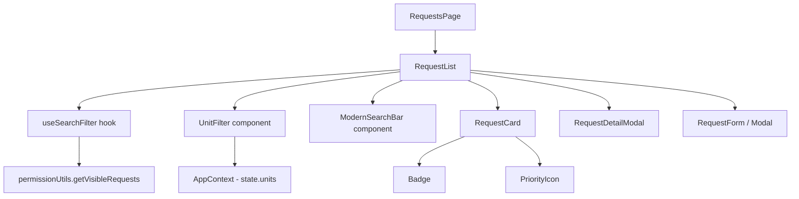
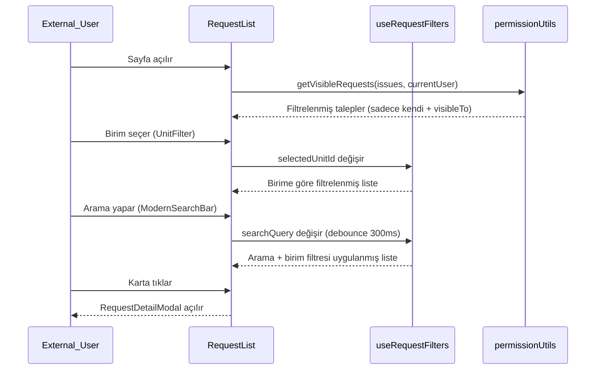

# Design Document: External User Requests UI Modernization

## Overview

Dış kullanıcının (`External_User`) gördüğü talepler ekranı (`RequestList` + `RequestCard`) modernize edilecek. Üç ana iyileştirme hedefleniyor: (1) kart tasarımının görsel kalitesini artırmak, (2) birimlere göre filtreleme eklemek, (3) arama deneyimini floating label, clear butonu, debounce ve highlight ile zenginleştirmek. Tüm değişiklikler mevcut React + Bootstrap 5 + react-icons/tb stack'i içinde kalacak; yeni kütüphane eklenmeyecek. Dış kullanıcının yalnızca kendi taleplerini veya `visibleTo` listesinde olduğu talepleri görmesi kuralı (`getVisibleRequests`) korunacak.

---

## Architecture



### Veri Akışı



---

## Components and Interfaces

### Component 1: `ModernSearchBar`

**Dosya:** `src/components/request/ModernSearchBar.jsx`

**Purpose:** Floating label, clear butonu, debounce (300ms) ve arama sonucu sayacı içeren modern arama bileşeni.

**Interface:**
```typescript
interface ModernSearchBarProps {
  value: string                    // Kontrollü input değeri (ham, debounce öncesi)
  onChange: (value: string) => void // Her tuş vuruşunda çağrılır
  resultCount: number              // Gösterilecek sonuç sayısı
  placeholder?: string             // Varsayılan: "Talep ara..."
}
```

**Responsibilities:**
- Floating label animasyonu (Bootstrap `form-floating` pattern)
- Sağ tarafta clear (×) butonu — değer doluyken görünür
- Arama ikonu (TbSearch) sol tarafta
- Sonuç sayısını `"{n} talep bulundu"` formatında gösterir
- Debounce mantığı dışarıda (`useRequestFilters` hook'unda) tutulur; bu bileşen sadece görsel

### Component 2: `UnitFilter`

**Dosya:** `src/components/request/UnitFilter.jsx`

**Purpose:** Birim seçimi için pill/chip tarzı filtre butonları.

**Interface:**
```typescript
interface UnitFilterProps {
  units: Unit[]                        // Gösterilecek birimler listesi
  selectedUnitId: string | null        // Seçili birim ID'si (null = Tümü)
  onChange: (unitId: string | null) => void
}

interface Unit {
  id: string
  name: string
  unitCode: string
}
```

**Responsibilities:**
- "Tümü" pill butonu + her birim için ayrı pill
- Seçili pill: `btn-primary` stili; seçisiz: `btn-outline-secondary`
- Birim yoksa (0 birim) render etmez
- Dış kullanıcı için birim listesi, görünür taleplerden türetilir (sadece taleplerin bulunduğu birimler gösterilir)

### Component 3: `RequestCard` (güncelleme)

**Dosya:** `src/components/request/RequestCard.jsx`

**Purpose:** Modernize edilmiş talep kartı — renk kodlaması, daha iyi tipografi, hover efekti.

**Interface:** (mevcut props korunur)
```typescript
interface RequestCardProps {
  request: Issue
  searchQuery?: string  // Highlight için eklenir
}
```

**Responsibilities:**
- Sol kenarda durum rengi çubuğu (4px border-left, `STATUS_COLORS` kullanır)
- Başlık içinde `searchQuery` eşleşmelerini `<mark>` ile highlight eder
- Öncelik ikonu + birim adı + tarih satırı korunur
- Hover'da hafif `translateY(-1px)` + shadow artışı
- Kart içinde `request.number` badge olarak gösterilir (mevcut `text-muted small` yerine)

### Component 4: `RequestList` (güncelleme)

**Dosya:** `src/components/request/RequestList.jsx`

**Purpose:** Tüm bileşenleri bir araya getiren ana liste bileşeni.

**Responsibilities:**
- `useRequestFilters` hook'unu kullanır
- `ModernSearchBar` ve `UnitFilter` bileşenlerini render eder
- Dış kullanıcı için birim filtresi görünür; iç kullanıcılar için mevcut rol bazlı filtreleme korunur
- Mevcut "Dış kullanıcıya görünür yap" (TbEye) butonu korunur

---

## Data Models

### `useRequestFilters` Hook

**Dosya:** `src/hooks/useRequestFilters.js`

```typescript
interface UseRequestFiltersReturn {
  searchQuery: string                    // Ham input değeri
  setSearchQuery: (q: string) => void
  debouncedQuery: string                 // 300ms debounce uygulanmış
  selectedUnitId: string | null
  setSelectedUnitId: (id: string | null) => void
  filteredRequests: Issue[]              // Tüm filtreler uygulanmış
  availableUnits: Unit[]                 // Görünür taleplerden türetilen birimler
  resultCount: number
}
```

**Filtreleme Sırası:**
1. `getVisibleRequests(issues, currentUser)` — izin katmanı (değişmez)
2. Rol bazlı filtreleme (Department_Head, Project_Manager, Worker) — değişmez
3. `selectedUnitId` filtresi — yeni
4. `debouncedQuery` ile title/description/number arama — mevcut `filterRequests` fonksiyonu kullanılır

### Highlight Yardımcı Fonksiyonu

```typescript
// src/utils/highlightUtils.js
function highlightText(text: string, query: string): React.ReactNode
// "query" ile eşleşen kısımları <mark> ile sarar
// query boşsa düz string döner
// Büyük/küçük harf duyarsız
```

---

## Algorithmic Pseudocode

### Debounce Mantığı (`useRequestFilters`)

```pascal
HOOK useRequestFilters(issues, currentUser, state)
  INPUT: issues[], currentUser, state (units, projects)
  OUTPUT: { filteredRequests, searchQuery, setSearchQuery, 
            debouncedQuery, selectedUnitId, setSelectedUnitId,
            availableUnits, resultCount }

  BEGIN
    searchQuery ← useState('')
    debouncedQuery ← useState('')
    selectedUnitId ← useState(null)

    // Debounce effect
    useEffect WHEN searchQuery CHANGES
      timer ← setTimeout(300ms) DO
        debouncedQuery ← searchQuery
      END
      RETURN () => clearTimeout(timer)
    END EFFECT

    // Visible requests (permission layer — unchanged)
    visibleRequests ← getVisibleRequests(issues, currentUser)

    // Role-based filtering (unchanged)
    IF role = DEPARTMENT_HEAD OR PROJECT_MANAGER THEN
      myUnitProjects ← projects WHERE unitId = currentUser.unitId
      visibleRequests ← visibleRequests WHERE projectId IN myUnitProjects
    END IF
    IF role = WORKER THEN
      visibleRequests ← visibleRequests WHERE projectId = currentUser.projectId
    END IF

    // Available units (derived from visible requests)
    unitCodes ← DISTINCT visibleRequests.map(r => r.unitCode)
    availableUnits ← units WHERE unitCode IN unitCodes

    // Unit filter
    IF selectedUnitId IS NOT NULL THEN
      selectedUnit ← units.find(u => u.id = selectedUnitId)
      visibleRequests ← visibleRequests WHERE unitCode = selectedUnit.unitCode
    END IF

    // Search filter (existing filterRequests function)
    filteredRequests ← filterRequests(visibleRequests, debouncedQuery)

    resultCount ← filteredRequests.length

    RETURN { filteredRequests, searchQuery, setSearchQuery,
             debouncedQuery, selectedUnitId, setSelectedUnitId,
             availableUnits, resultCount }
  END
```

### Highlight Algoritması

```pascal
FUNCTION highlightText(text, query)
  INPUT: text: string, query: string
  OUTPUT: React.ReactNode (string veya JSX array)

  BEGIN
    IF query IS EMPTY OR WHITESPACE THEN
      RETURN text
    END IF

    escapedQuery ← escapeRegex(query.trim())
    regex ← new RegExp('(' + escapedQuery + ')', 'gi')
    parts ← text.split(regex)

    RETURN parts.map(part =>
      IF regex.test(part) THEN
        <mark key={index} className="bg-warning bg-opacity-50 rounded-1 px-0">{part}</mark>
      ELSE
        part
      END IF
    )
  END
```

---

## Key Functions with Formal Specifications

### `filterRequests(requests, searchQuery)` — mevcut, korunur

**Preconditions:**
- `requests` geçerli bir dizi (boş olabilir)
- `searchQuery` string (null/undefined değil)

**Postconditions:**
- `searchQuery` boşsa tüm `requests` döner
- Her dönen eleman: `title`, `description` veya `number` alanında `searchQuery` içerir (büyük/küçük harf duyarsız)
- Orijinal `requests` dizisi mutate edilmez

### `highlightText(text, query)`

**Preconditions:**
- `text` string (boş olabilir)
- `query` string (boş olabilir)

**Postconditions:**
- `query` boşsa `text` string olarak döner
- `query` doluysa: dönen node'larda `query` ile eşleşen her kısım `<mark>` ile sarılır
- Eşleşme büyük/küçük harf duyarsızdır
- Tüm orijinal metin korunur (hiçbir karakter kaybolmaz)

### `UnitFilter` render koşulu

**Preconditions:**
- `units` array

**Postconditions:**
- `units.length === 0` ise `null` döner (render yok)
- `units.length > 0` ise "Tümü" + her birim için pill render edilir
- `selectedUnitId === null` iken "Tümü" pill'i `btn-primary` stilinde

---

## Correctness Properties

1. **İzin koruması**: `getVisibleRequests` her zaman ilk filtre adımıdır; `selectedUnitId` veya `searchQuery` bu katmanı bypass edemez.
2. **Birim filtresi tutarlılığı**: `availableUnits` yalnızca `visibleRequests` içindeki birimlerden türetilir; kullanıcı hiç talebi olmayan bir birimi göremez.
3. **Debounce kararlılığı**: Bileşen unmount olduğunda timeout temizlenir; stale state güncellemesi olmaz.
4. **Highlight güvenliği**: `highlightText` regex özel karakterleri escape eder; kullanıcı girdisi regex injection'a yol açmaz.
5. **Boş durum doğruluğu**: `filteredRequests.length === 0` durumunda `searchQuery` veya `selectedUnitId` aktifse "sonuç yok" mesajı; ikisi de boşsa "henüz talep yok" mesajı gösterilir.

---

## Error Handling

### Senaryo 1: Birim bulunamadı

**Koşul:** `request.unitCode` ile eşleşen birim `state.units`'te yok  
**Yanıt:** `RequestCard` birim adını göstermez (mevcut davranış korunur)  
**Kurtarma:** Kart diğer bilgilerle render edilmeye devam eder

### Senaryo 2: Boş talepler listesi

**Koşul:** `filteredRequests.length === 0`  
**Yanıt:** `EmptyState` bileşeni gösterilir; mesaj aktif filtreye göre değişir  
**Kurtarma:** Kullanıcı filtreyi temizleyebilir

### Senaryo 3: Regex özel karakteri içeren arama

**Koşul:** Kullanıcı `(`, `)`, `[`, `*` gibi karakterler girer  
**Yanıt:** `highlightText` içinde `escapeRegex` ile sanitize edilir  
**Kurtarma:** Arama normal çalışır, hata fırlatılmaz

---

## Testing Strategy

### Unit Testing

- `filterRequests`: boş query, eşleşen query, eşleşmeyen query, büyük/küçük harf
- `highlightText`: boş query, tek eşleşme, çoklu eşleşme, regex özel karakterler
- `useRequestFilters`: debounce davranışı (fake timers), birim filtresi, izin katmanı bypass edilemez

### Component Testing

- `ModernSearchBar`: clear butonu görünürlüğü, onChange çağrısı, sonuç sayısı
- `UnitFilter`: "Tümü" seçimi, birim seçimi, boş birim listesinde render yok
- `RequestCard`: highlight render, durum renk çubuğu, hover stili

### Integration Testing

- Dış kullanıcı yalnızca kendi taleplerini görür (birim filtresi aktifken de)
- Birim filtresi + arama birlikte doğru çalışır
- Debounce: hızlı yazımda tek API/filtre çağrısı

---

## Performance Considerations

- Debounce 300ms: her tuş vuruşunda filtre hesaplanmaz
- `availableUnits` useMemo ile memoize edilir (visibleRequests değişmediğinde yeniden hesaplanmaz)
- `highlightText` saf fonksiyon; React.memo ile sarılmış `RequestCard` gereksiz re-render'ı önler

---

## Security Considerations

- Dış kullanıcı izin kuralı (`getVisibleRequests`) UI katmanında korunur; bu kural hiçbir yeni filtre tarafından genişletilemez
- `highlightText` regex escape ile XSS benzeri injection önlenir
- Birim filtresi yalnızca görünür taleplerden türetilen birimleri gösterir; kullanıcı erişimi olmayan birimleri keşfedemez

---

## Dependencies

- React 18 (mevcut)
- Bootstrap 5 (mevcut)
- react-icons/tb — `TbSearch`, `TbX`, `TbBuilding`, `TbCalendar` (mevcut)
- Yeni kütüphane eklenmez
