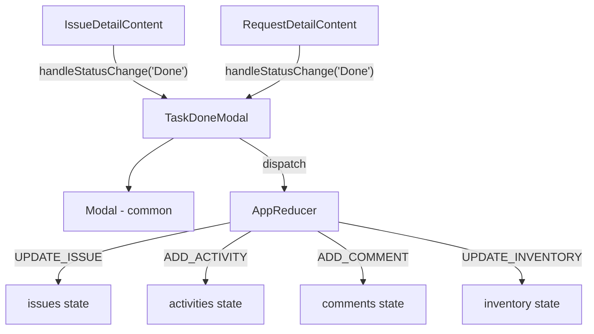
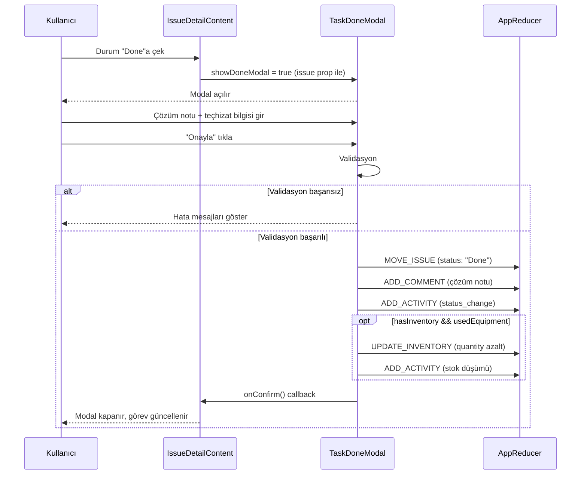
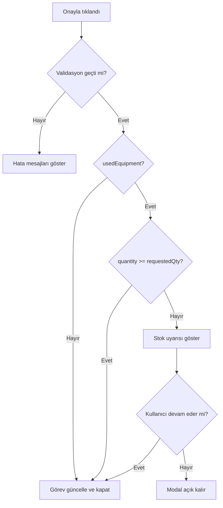

# Tasarım Dokümanı: Task Done Modal

## Genel Bakış

Bu özellik, bir görev (issue/task/request) "Done" statüsüne çekildiğinde kullanıcıdan ek bilgi toplayan bir modal bileşeni ekler. Modal; çözüm notunun zorunlu olarak girilmesini, projenin stok takibi aktifse teçhizat kullanımının belirtilmesini ve stok düşümünün otomatik yapılmasını sağlar.

Özellik üç temel amaca hizmet eder:
1. **Dokümantasyon**: Tamamlanan her görev için çözüm notu zorunlu tutularak iş geçmişi kayıt altına alınır.
2. **Stok Takibi**: `hasInventory: true` olan projelerde kullanılan teçhizat miktarı stoktan düşülür.
3. **Veri Bütünlüğü**: Görev "Done"a geçmeden önce gerekli bilgilerin eksiksiz girilmesi garanti edilir.

### Kapsam

- `IssueDetailContent` ve `RequestDetailContent` bileşenlerindeki `handleStatusChange` fonksiyonu güncellenir.
- `src/components/common/TaskDoneModal.jsx` yeniden kullanılabilir bileşen olarak oluşturulur.
- `AppContext` state'ine `inventory` array'i eklenir.
- `AppReducer`'a `UPDATE_INVENTORY` action handler'ı eklenir.
- `seedData.js` dosyasına örnek teçhizat verileri eklenir.

---

## Mimari

### Bileşen Hiyerarşisi



### Veri Akışı



---

## Bileşenler ve Arayüzler

### TaskDoneModal Bileşeni

**Konum:** `src/components/common/TaskDoneModal.jsx`

**Props:**

| Prop | Tip | Zorunlu | Açıklama |
|------|-----|---------|----------|
| `isOpen` | `boolean` | ✓ | Modal'ın görünür olup olmadığı |
| `issue` | `Object` | ✓ | Görev nesnesi (id, projectId, status vb.) |
| `onConfirm` | `Function` | ✓ | Başarılı onaylama sonrası çağrılır |
| `onCancel` | `Function` | ✓ | İptal veya kapatma sonrası çağrılır |

**İç State:**

| State | Tip | Başlangıç | Açıklama |
|-------|-----|-----------|----------|
| `resolutionNote` | `string` | `''` | Çözüm notu metni |
| `usedEquipment` | `boolean` | `false` | Teçhizat kullanıldı mı |
| `selectedEquipmentId` | `string` | `''` | Seçilen teçhizat ID'si |
| `quantity` | `string` | `''` | Kullanılan adet (string, parse edilir) |
| `errors` | `Object` | `{}` | Alan bazlı hata mesajları |
| `showStockWarning` | `boolean` | `false` | Stok yetersiz uyarısı gösterilsin mi |

**Render Koşulları:**

- Teçhizat bölümü: `project.hasInventory === true` ise gösterilir.
- Teçhizat detay alanları: `usedEquipment === true` ise gösterilir.
- Stok uyarısı: `selectedEquipment.quantity < parseInt(quantity)` ise gösterilir.

### IssueDetailContent Değişiklikleri

`handleStatusChange` fonksiyonu güncellenir:

```javascript
function handleStatusChange(newStatus) {
  if (newStatus === issue.status) { setEditingStatus(false); return; }
  if (newStatus === 'Done') {
    setShowDoneModal(true);  // Modal'ı aç, durumu henüz değiştirme
    setEditingStatus(false);
    return;
  }
  // "Done" dışındaki geçişler eskisi gibi çalışır
  dispatch({ type: ACTIONS.MOVE_ISSUE, payload: { issueId: issue.id, newStatus } });
  dispatchActivity(`Durum "${issue.status}" → "${newStatus}" olarak değiştirildi`, ACTIVITY_TYPES.STATUS_CHANGE);
  setEditingStatus(false);
}
```

Yeni state eklenir: `const [showDoneModal, setShowDoneModal] = useState(false);`

### RequestDetailContent Değişiklikleri

`IssueDetailContent` ile aynı pattern uygulanır. `handleStatusChange` fonksiyonu aynı şekilde güncellenir.

---

## Veri Modelleri

### Inventory Item

```javascript
{
  id: string,          // Benzersiz ID (generateId() ile üretilir)
  projectId: string,   // Ait olduğu projenin ID'si
  name: string,        // Teçhizat adı (örn. "Ethernet Kablosu")
  quantity: number,    // Mevcut stok miktarı (negatif olabilir)
  unit: string,        // Birim (örn. "adet", "metre", "kutu")
}
```

### AppContext State Güncellemesi

```javascript
// Mevcut state'e eklenir:
{
  // ... mevcut alanlar
  inventory: InventoryItem[]  // Yeni alan
}
```

### UPDATE_INVENTORY Action

```javascript
// Dispatch:
dispatch({
  type: ACTIONS.UPDATE_INVENTORY,
  payload: {
    inventoryId: string,    // Güncellenecek teçhizat ID'si
    quantityChange: number, // Negatif değer = düşüm, pozitif = artış
  }
});

// Reducer sonucu:
inventory.map(item =>
  item.id === inventoryId
    ? { ...item, quantity: item.quantity + quantityChange }
    : item
)
```

### Seed Inventory Örneği

```javascript
export const seedInventory = [
  { id: 'inv-1', projectId: 'project-bigd-1', name: 'Ethernet Kablosu', quantity: 100, unit: 'metre' },
  { id: 'inv-2', projectId: 'project-bigd-1', name: 'RJ45 Konnektör',   quantity: 200, unit: 'adet'  },
  { id: 'inv-3', projectId: 'project-bigd-1', name: 'Patch Panel',       quantity: 10,  unit: 'adet'  },
  { id: 'inv-4', projectId: 'project-bigd-1', name: 'Fiber Optik Kablo', quantity: 50,  unit: 'metre' },
  { id: 'inv-5', projectId: 'project-bigd-1', name: 'Network Switch',    quantity: 5,   unit: 'adet'  },
];
```

`project-bigd-1` projesinin `hasInventory: true` olarak güncellenmesi gerekir.

---

## Doğruluk Özellikleri

*Bir özellik (property), bir sistemin tüm geçerli çalışmalarında doğru olması gereken bir karakteristik veya davranıştır — temelde sistemin ne yapması gerektiğine dair biçimsel bir ifadedir. Özellikler, insan tarafından okunabilir spesifikasyonlar ile makine tarafından doğrulanabilir doğruluk garantileri arasındaki köprü görevi görür.*

### Özellik 1: "Done" Dışı Durum Geçişleri Modal Açmaz

*Herhangi bir* görev ve "Done" dışındaki herhangi bir hedef durum için, `handleStatusChange` çağrıldığında `showDoneModal` state'i `false` kalmalıdır.

**Doğrular: Gereksinim 1.5**

---

### Özellik 2: Modal Onaylanmadan Durum Değişmez

*Herhangi bir* görev için, `handleStatusChange("Done")` çağrıldıktan sonra modal onaylanmadan görevin `status` alanı "Done" olmamalıdır.

**Doğrular: Gereksinim 1.2, 1.3**

---

### Özellik 3: İptal Sonrası Durum Korunur

*Herhangi bir* görev ve herhangi bir başlangıç durumu için, modal iptal edildiğinde görevin `status` alanı orijinal değerinde kalmalıdır.

**Doğrular: Gereksinim 1.4, 5.6**

---

### Özellik 4: Çözüm Notu Uzunluk Validasyonu

*Herhangi bir* string için, uzunluğu 10'dan az veya 2000'den fazla ise `validate` fonksiyonu hata döndürmeli; 10 ile 2000 karakter arasındaki (sınırlar dahil) herhangi bir string için hata döndürmemelidir.

**Doğrular: Gereksinim 2.3, 2.4, 2.5, 2.6**

---

### Özellik 5: Geçerli Onaylama Activity Log'a Eklenir

*Herhangi bir* geçerli çözüm notu ile modal onaylandığında, `activities` array'inde `type: "comment"` olan ve çözüm notunu içeren bir kayıt bulunmalıdır.

**Doğrular: Gereksinim 2.7, 5.2**

---

### Özellik 6: hasInventory Teçhizat Bölümü Görünürlüğünü Belirler

*Herhangi bir* proje için, `hasInventory: true` ise modal render edildiğinde teçhizat bölümü görünür olmalı; `hasInventory: false` ise teçhizat bölümü render edilmemelidir.

**Doğrular: Gereksinim 3.1, 3.2**

---

### Özellik 7: usedEquipment Teçhizat Detay Alanlarını Kontrol Eder

*Herhangi bir* modal state için, `usedEquipment: true` iken teçhizat adı selectbox'ı ve kullanılan adet input'u render edilmeli; `usedEquipment: false` iken bu alanlar render edilmemelidir.

**Doğrular: Gereksinim 3.5, 3.6, 4.1, 4.2**

---

### Özellik 8: Teçhizat Selectbox Proje Stoğunu Yansıtır

*Herhangi bir* proje ve o projeye ait inventory listesi için, teçhizat selectbox'ındaki seçenekler tam olarak o projenin inventory item isimlerini içermelidir.

**Doğrular: Gereksinim 4.3**

---

### Özellik 9: Teçhizat Alanları "Evet" Seçildiğinde Zorunludur

*Herhangi bir* modal state için, `usedEquipment: true` iken `equipmentId` boş veya `quantity` ≤ 0 ise `validate` fonksiyonu hata döndürmelidir.

**Doğrular: Gereksinim 4.4, 4.5, 4.7, 4.8**

---

### Özellik 10: Kullanılan Adet Pozitif Tam Sayı Olmalıdır

*Herhangi bir* pozitif tam sayı için `validate` fonksiyonu hata döndürmemeli; sıfır veya negatif herhangi bir sayı için hata döndürmelidir.

**Doğrular: Gereksinim 4.6, 4.7**

---

### Özellik 11: Geçerli Onaylama Görevi "Done"a Taşır ve resolvedAt'ı Günceller

*Herhangi bir* geçerli form verisi ile modal onaylandığında, dispatch edilen `MOVE_ISSUE` action'ının payload'ında `newStatus: "Done"` ve `UPDATE_REQUEST_DATES` payload'ında `resolvedAt` null olmamalıdır.

**Doğrular: Gereksinim 5.1, 5.3**

---

### Özellik 12: Stok Düşümü Doğru Hesaplanır

*Herhangi bir* inventory item ve kullanılan adet için, onaylama sonrası `UPDATE_INVENTORY` action'ının `quantityChange` değeri `-(kullanılan adet)` olmalıdır; yani yeni quantity = önceki quantity - kullanılan adet.

**Doğrular: Gereksinim 6.1**

---

### Özellik 13: Stok Yetersizliği Uyarısı Tetiklenir

*Herhangi bir* inventory item ve talep edilen miktar için, `item.quantity < requestedQuantity` koşulu sağlandığında `showStockWarning` state'i `true` olmalıdır.

**Doğrular: Gereksinim 6.3**

---

### Özellik 14: UPDATE_INVENTORY Reducer Doğru Günceller

*Herhangi bir* inventory item ve `quantityChange` değeri için, `UPDATE_INVENTORY` action dispatch edildiğinde ilgili item'ın `quantity` değeri `önceki + quantityChange` olmalı; diğer item'lar değişmemelidir.

**Doğrular: Gereksinim 9.4, 9.5**

---

### Özellik 15: Stok Yetersiz Hata Mesajı Doğru Formatlanır

*Herhangi bir* (mevcut stok X, talep edilen Y) çifti için, stok yetersizliği mesajı "Stok miktarı yetersiz. Mevcut: X, Talep edilen: Y" formatında olmalı ve X ile Y değerleri doğru gösterilmelidir.

**Doğrular: Gereksinim 10.3**

---

## Hata Yönetimi

### Validasyon Kuralları

| Alan | Kural | Hata Mesajı |
|------|-------|-------------|
| Çözüm Notu | Boş veya sadece boşluk olamaz | "Çözüm içeriği zorunludur." |
| Çözüm Notu | Min 10 karakter | "Çözüm içeriği en az 10 karakter olmalıdır." |
| Çözüm Notu | Max 2000 karakter | "Çözüm içeriği en fazla 2000 karakter olabilir." |
| Teçhizat Adı | usedEquipment=true iken boş olamaz | "Lütfen bir teçhizat seçin." |
| Kullanılan Adet | usedEquipment=true iken boş olamaz | "Kullanılan adet zorunludur." |
| Kullanılan Adet | Pozitif tam sayı olmalı | "Lütfen geçerli bir sayı girin." |
| Kullanılan Adet | Sıfır veya negatif olamaz | "Lütfen geçerli bir sayı girin." |

### Stok Yetersizliği Akışı



### Hata Gösterimi

- Her hata mesajı ilgili form alanının hemen altında kırmızı renkte gösterilir.
- Hatalı alanlar Bootstrap `is-invalid` class'ı ile kırmızı border alır.
- Tüm mesajlar Türkçe dilindedir.
- Kullanıcı alanı düzeltmeye başladığında hata temizlenir.

---

## Test Stratejisi

### Genel Yaklaşım

Bu özellik hem saf fonksiyon mantığı (validasyon, reducer) hem de React bileşen davranışı içerdiğinden **ikili test yaklaşımı** uygulanır:

- **Birim testleri**: Belirli örnekler, kenar durumlar ve hata koşulları
- **Özellik tabanlı testler (PBT)**: Geniş input uzayında evrensel özelliklerin doğrulanması

### Özellik Tabanlı Test Kütüphanesi

**fast-check** (JavaScript/React projeleri için standart PBT kütüphanesi) kullanılır.

```bash
npm install --save-dev fast-check
```

Her özellik testi **minimum 100 iterasyon** ile çalıştırılır.

### Test Etiket Formatı

Her özellik testi şu formatta etiketlenir:

```javascript
// Feature: task-done-modal, Property N: <özellik metni>
```

### Test Dosyaları

| Dosya | Kapsam |
|-------|--------|
| `src/components/common/TaskDoneModal.test.js` | Modal bileşeni (render, validasyon, callback'ler) |
| `src/context/AppReducer.test.js` | UPDATE_INVENTORY reducer |
| `src/utils/taskDoneValidation.test.js` | Validasyon fonksiyonları (saf fonksiyon PBT) |

### Özellik Testleri (PBT)

```javascript
// Feature: task-done-modal, Property 4: Çözüm Notu Uzunluk Validasyonu
fc.assert(fc.property(
  fc.string({ minLength: 0, maxLength: 9 }),
  (shortNote) => {
    const errors = validate({ resolutionNote: shortNote.trim() || '' });
    return errors.resolutionNote !== undefined;
  }
), { numRuns: 100 });

// Feature: task-done-modal, Property 14: UPDATE_INVENTORY Reducer Doğru Günceller
fc.assert(fc.property(
  fc.array(fc.record({ id: fc.string(), quantity: fc.integer() }), { minLength: 1 }),
  fc.integer(),
  (items, quantityChange) => {
    const targetId = items[0].id;
    const before = items[0].quantity;
    const newState = AppReducer(
      { inventory: items },
      { type: ACTIONS.UPDATE_INVENTORY, payload: { inventoryId: targetId, quantityChange } }
    );
    const after = newState.inventory.find(i => i.id === targetId).quantity;
    return after === before + quantityChange;
  }
), { numRuns: 100 });
```

### Birim Testleri

- Modal'ın `hasInventory: false` projeyle render edildiğinde teçhizat bölümünün görünmediği
- Modal'ın `hasInventory: true` projeyle render edildiğinde teçhizat bölümünün göründüğü
- "İptal" butonuna tıklandığında `onCancel` callback'inin çağrıldığı
- Geçerli form verisiyle "Onayla" tıklandığında `onConfirm` callback'inin çağrıldığı
- Stok yetersiz uyarısının doğru X ve Y değerleriyle gösterildiği
- Seed inventory verilerinin gerekli alanları içerdiği

### Entegrasyon Testleri

- `IssueDetailContent`'te "Done" butonuna tıklandığında `TaskDoneModal`'ın açıldığı
- `RequestDetailContent`'te "Done" butonuna tıklandığında `TaskDoneModal`'ın açıldığı
- Tam akış: Modal açılır → form doldurulur → onaylanır → görev "Done"a geçer → activity log güncellenir
